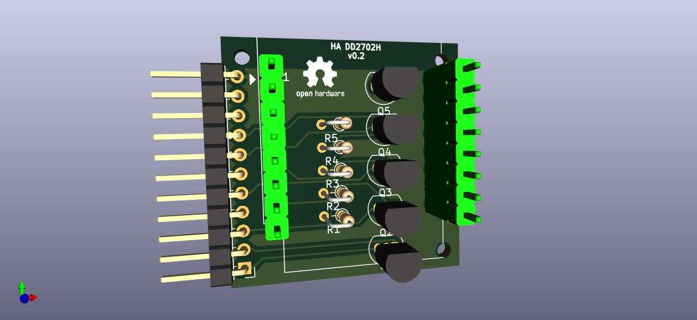
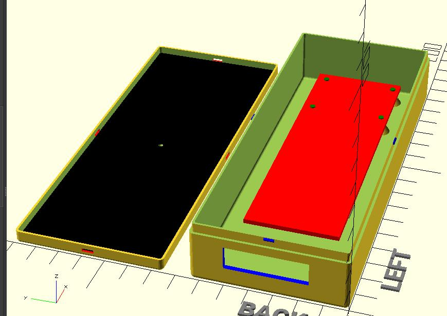
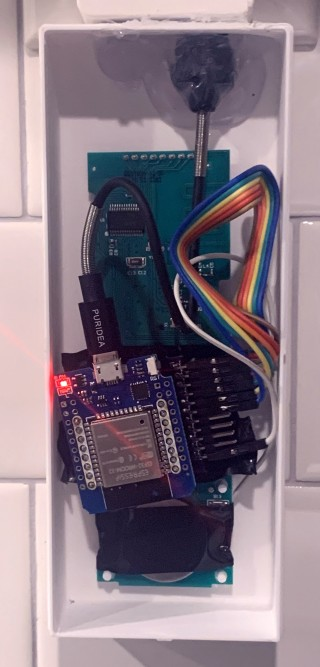
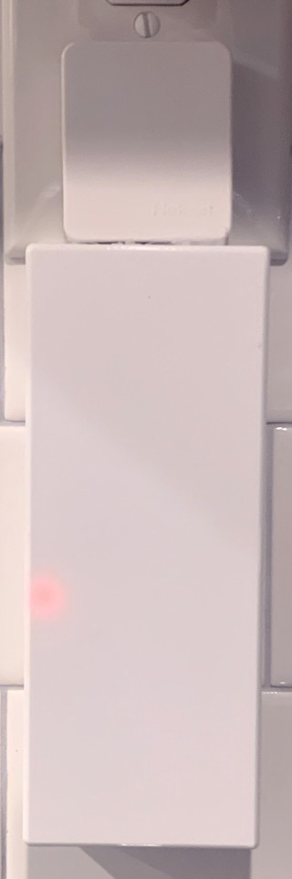

# Home Automation - DD2702H

A **quick and dirty** interface to the DD2702H remote.

Seriously. This is hacky hack hacky. But it's all hidden in a nice little case, so I don't really care.  
It requires removing the DD2702H from the stock case, soldering some wires to it, and hooking up an esp32.

## Build of Materials

* 1 - DD2702H remote
* 1 - Custom PCB
* 1 - Nekmit Dual Port Ultra Thin Flat USB Wall Charger
* 1 - Wemos D1 Mini (esp32)
* 2 - Strips of female connectors for Wemos D1 Mini
* 3 - 1k through-hole resistors
* 3 - 2N3904 PNP transistors
* 1 - DD2702H Remote
* 11 - Male pins; angled preferred
* Some wires to connect them

## Program

The [example yaml](program/dd2702h.yaml) for ESPHome contains all you should need to get started. 
ESPHome is awesome, and I'm lazy.

## PCB

I ordered the PCB from OSHPark.com by uploading the KiCAD files.
Turn-around time was a week, and the boards from OSHPark are high quality.

## Case 

The case I've printed and am using is provided in the `case` folder as an `.stl` file. 
There's also the openscad source, if you're interested. It requires [YAPP_Box](https://github.com/mrWheel/YAPP_Box) to work.

**Assembly Guide**

* Remove remote PCB from stock enclosure
* Solder wires to the up/stop/down buttons; optionally the channel buttons (I skipped the channel buttons)
* Solder ground wire to remote button battery holder
* Solder female pins into Wemos D1 Mini spot
* Solder resistors
* Solder transistors matching silkscreen
* Solder male header pins
* Solder wires to remote buttons as desired - one end should be a female connector
* Use electrical tape to hold the battery in position
* Use electrical tape to protect the bottom of the custom PCB
* Insert the remote PCB into the case; it should fit nicely on the pegs
* Place a dab of hotglue in the center; place the custom PCB on top of it
* Connect a USB cable to the Nekmit; hot glue that sucker down
* Put the lid on the case
* Plug into wall

